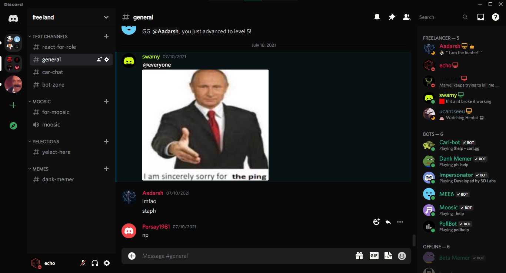
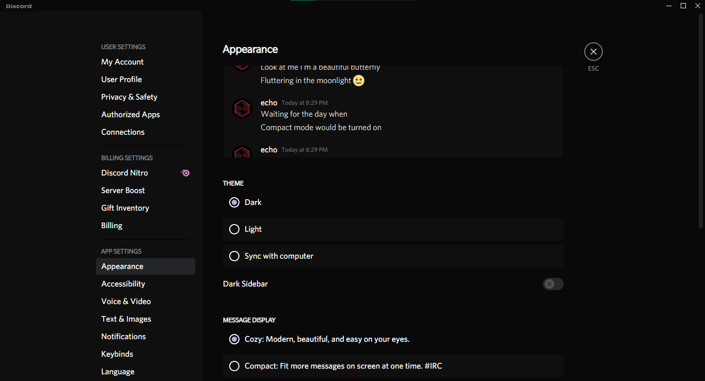

# Midnight Darkness
A dark theme for BetterDiscord which replaces the grey colors in the default Discord dark theme with shades of black.

## Appearance

## Installation
1. Grab a copy of the latest release [here](https://github.com/afk-echo/midnight-darkness-bdtheme/releases)!
2. On Discord, open `User Settings > Themes > Open Themes Folder` and drop the `midnight-darkness.theme.css` file into it.
3. Click on the Refresn icon next to the `Open Themes Folder` for loading the theme.
4. Enable `Midnight Darkness` in the menu.

You should now be up and running with the new darker theme. Have fun!
